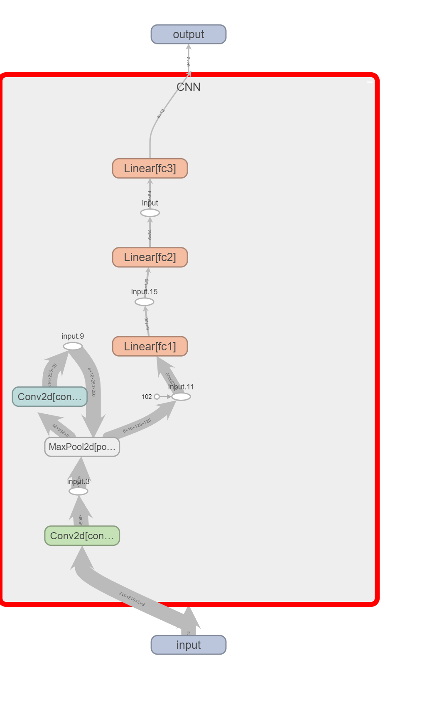
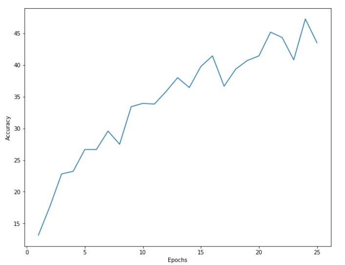
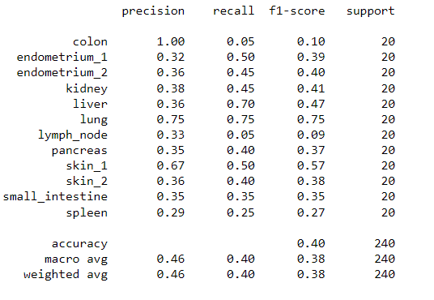
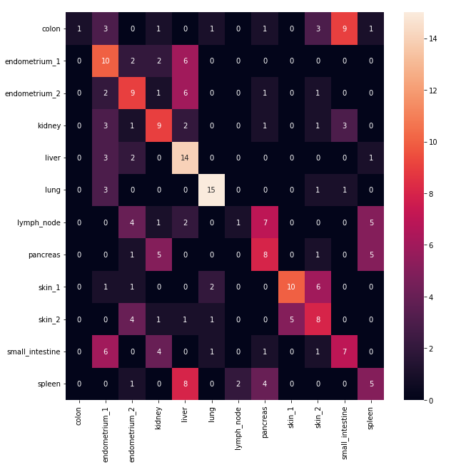
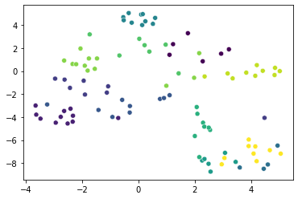

# Image_classification

This project is part of the submission for skill test.  

# Task 1 Image Classification

## 1 Training 2 different models

### a. Download the image classification data
### b. Train a classification model(without using a pre-trained model):

For this problem, I used pytorch. The file I used to solve this problem is `dataloader_scratch.ipynb`. Here, at first, we were given a single train folder dataset so I had to split the dataset using the python module called *splitfolders*. Using this, I splitted the data between train and test. Transform fucntion was written and custom dataset functions was used and then DataLoader was used to fetch the images. 

Here, I kept batch size as 4 and I tried with larger batch size but the results were not good enough. I trained the model for 25 epochs and mean and standard deviation was calculated using a manual function as in my testing, it was giving better results and converding faster compared to normalizing with 0.5 as mean and 0.25 as standard deviation. I decided to resize the image to (512,512) as I felt that it contained enough information to give decent results. I also used transformations such as `RandomHorizontalFlip`, `RandomRotation`,`RandomVerticalFlip` because my training accuracy was high but testing accuracy was significantly lower. Which meant that I was overfitting.

I decided to make simple CNN model without adding more layers and making it complex since I had limited resources available and I had already used google colab a lot in last few days. I tried using IU server's but dataset was huge so I didn't find an appropriate server with CUDA support and storage options. 

<!--  -->

I used SGD optimizer and cross-entropy loss function with learning rate as 0.0025 and 0.9 as momentum. I did't have time to optimize these hyperparameters but we can use optuna or reytune to optimize them to get better result.

This is the accuracy of the training data which is quite low but as suggested, more complex model would have given much better results.

Below, is the classification report:

Also, we have confusion matrix to compare the test result:

We received the test accuracy of 41% which is quite bad.

### c. Train using pre-trained model:

For this problem, I decided to use `ResNet18` as transfer learning does significantly improve the performance and reduces the training time. 

The approach was the same for this problem as well. I have uploaded the file `FineTuning_RA.ipynb`. I didn't resize the image as I ran this code on colab and I didn't wanna miss any significant information in this approach. Unfortunately, as dataset was updated at the last moment, I couldn't make visualization after the updates as my colab was overused by then. But I have provided the saved_model `CNS_final_tuning.pth` which I trained before the dataset was updated. I was getting around 75% accuracy for training and 60% accuracy for test.

## 2 Visualization

I decided to use t-SNE to visualize the data.

I have added the file `TSNE.ipynb` to refer.

I haven't added the legends yet because I was out of colab limit. Sorry for this blunder. 

