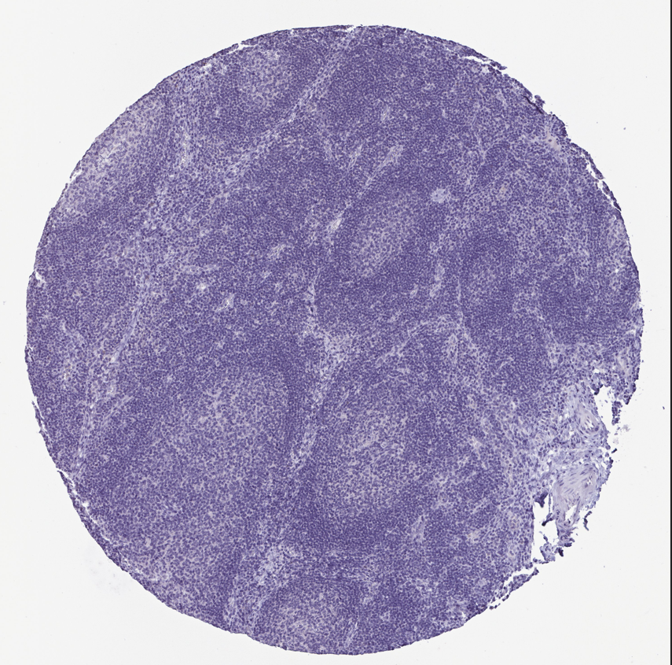

# Image_classification

This project is part of the submission for skill test.  

# Task 1 Image Classification

## 1 Training 2 different models

### a. Download the image classification data
### b. Train a classification model(without using a pre-trained model):

For this problem, I used pytorch. The file I used to solve this problem is `dataloader_scratch.ipynb`. Here, at first, we were given a single train folder dataset so I had to split the dataset using the python module called *splitfolders*. Using this, I splitted the data between train and test. Transform fucntion was written and custom dataset functions was used and then DataLoader was used to fetch the images. 

Here, I kept batch size as 4 and I tried with larger batch size but the results were not good enough. I trained the model for 25 epochs and mean and standard deviation was calculated using a manual function as in my testing, it was giving better results and converding faster compared to normalizing with 0.5 as mean and 0.25 as standard deviation. I decided to resize the image to (512,512) as I felt that it contained enough information to give decent results. I also used transformations such as `RandomHorizontalFlip`, `RandomRotation`,`RandomVerticalFlip` because my training accuracy was high but testing accuracy was significantly lower. Which meant that I was overfitting.

I decided to make simple CNN model without adding more layers and making it complex since I had limited resources available and I had already used google colab a lot in last few days. I tried using IU server's but dataset was huge so I didn't find an appropriate server with CUDA support and storage options. 

<!--  -->

I used SGD optimizer and cross-entropy loss function with learning rate as 0.0025 and 0.9 as momentum. I did't have time to optimize these hyperparameters but we can use optuna or reytune to optimize them to get better result.

This is the accuracy of the training data which is quite low but as suggested, more complex model would have given much better results.

Below, is the classification report:

Also, we have confusion matrix to compare the test result:

We received the test accuracy of 41% which is quite bad.

### c. Train using pre-trained model:

For this problem, I decided to use `ResNet18` as transfer learning does significantly improve the performance and reduces the training time. 

The approach was the same for this problem as well. I have uploaded the file `FineTuning_RA.ipynb`. I decided to use resize the image to 512*512 pixels as I thought that it was a good trade-off between computing power and preserving information of images. I added a new layes on top of the `ResNet18` and used cross-entropy function which incorporated softax activation function which is what we wanted to train multi-class classification model. Again, I'm using Stochastic gradient descent as my optimizer fucntion. I am also using `lr_scheduler` for adjusting the learning rate based on the number of epochs as learning rate is an important hyperparameter for good model performance. Though I didn't have time to change other hyperparameters.

To analyze how our model did, I plotted the accuracy score and loss score same as we did in the part b.

We are getting training accuracy of around 77% and test accuracy of around 67%. As before there was only training dataset, I divided the train dataset into train data and test data with the split of 0.8 and 0.2 so I had to train the model again. The accuracy can be improved if we run the model for more epochs.

Here is the classification report created: As we can see that spleen performed extremely poorly and we would analyze why it performed poorly in the confusion matrix.

Here is the confusion matrix: Here, we can see that spleen is falsely classified as lymph_node and we will see why that is the case in t-SNE.

## 2 Visualization

I decided to use t-SNE to visualize the data. This is the plot for train dataset. From the graph, we can analyze that lymph_node and spleen have somewhat similar features and model is not able to clearly distinguish between them. Which can be seen in the images as well as these two looks almost same from the perpective of inexperienced observer. Tissues of Liver is also proven quite difficult to distinguish as it is scattered all over the graph. This is also evident in confusion matrix.

I have also plotted the t-SNE for test data, and below is the result. Even in the test dataset, it is having difficulties to distinguish between lymph_node tissue and spleen tissue. 

Here are Spleen tissues and lymph_node tissues:

## 3 Explanation has been given in part 1 and part 2

## 4 Research paper summary is file `summary_RA.pdf`

